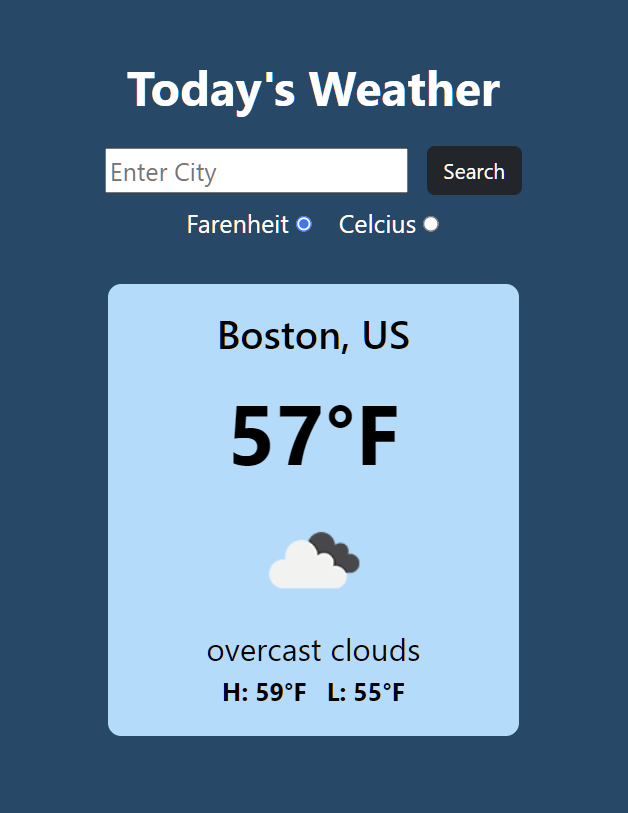

# Weather Now

A weather app that utilizes the OpenWeather API to get the current weather conditions for a city entered by the user. It displays the city's current temperature, the high/low temperature for the day, and a description of the weather with a corresponding image. 

